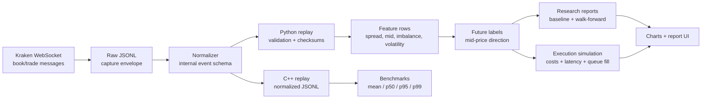

<div align="center">

# Market Microstructure Lab

Market Microstructure Lab is a quant research and engineering project focused on
order-book dynamics, short-horizon price movement, and realistic execution assumptions.

<br>

`market-microstructure` `order-book` `limit-order-book` `quant-research` `execution-simulation` `cpp20` `python`

</div>

---

## What This Project Does

Market Microstructure Lab turns public order-book messages into a research pipeline:

1. Capture raw exchange WebSocket messages.
2. Normalize them into a stable internal JSONL schema.
3. Replay the book in Python for reference correctness.
4. Generate microstructure features and future mid-price labels.
5. Run chronological baselines and walk forward validation.
6. Simulate execution with spread, fees, slippage, latency, and queue-fill assumptions.
7. Replay normalized book events in C++ and benchmark the critical path.
8. Generate charts and a static local report UI.

This is not a live-trading system. It has no broker integration and makes no production HFT claim.

## At A Glance

| Layer | What it contains |
| --- | --- |
| Data | Raw JSONL capture, normalized book/trade events, schema docs |
| Research | Python replay, features, labels, baselines, walk-forward validation |
| Execution | Cost-aware simulation with latency and partial fill assumptions |
| Systems | C++20 order book, normalized JSONL replay, replay benchmark percentiles |
| Reporting | JSON reports, SVG charts, static HTML report UI |

## Architecture



## Repository Layout

```text
marketMicstrLab/
  cpp/                  C++ order book, replay tools, benchmarks, tests
  data/                 Local raw and processed data; ignored by git
  docs/                 Architecture, schemas, project notes, phase plan
  reports/              Research note; generated reports are ignored
  src/                  Python package
  tests/                Python test suite
  benchmarks/           Benchmark notes and result guidance
```

## Requirements

| Tool | Version | Why |
| --- | --- | --- |
| Python | 3.11+ | Research pipeline and CLIs |
| pip | recent | Editable package install |
| CMake | 3.20+ | C++ build configuration |
| C++ compiler | C++20 capable | C++ replay and benchmarks |
| Ninja | optional | Faster CMake builds |

Install the system tools with your platform package manager. Examples:

```bash
# macOS with Homebrew
brew install python@3.11 cmake ninja

# Ubuntu / Debian
sudo apt-get update
sudo apt-get install python3.11 python3.11-venv cmake ninja-build build-essential
```

If your system already has Python 3.11+ and CMake, you can skip those commands.

## Quickstart

Clone the repository:

```bash
git clone https://github.com/peprick/marketMicstrLab.git
cd marketMicstrLab
```

Create a virtual environment and install the Python package:

```bash
python3.11 -m venv .venv
source .venv/bin/activate
python -m pip install --upgrade pip
python -m pip install -e . pytest
```

Run the Python tests:

```bash
pytest tests
```

Build and test the C++ targets:

```bash
cmake -S . -B build -G Ninja
cmake --build build
ctest --test-dir build --output-on-failure
```

If Ninja is not installed, use the default CMake generator:

```bash
cmake -S . -B build
cmake --build build
ctest --test-dir build --output-on-failure
```

## Full Research Workflow

Generated market data, reports, figures, and report-site outputs are intentionally ignored by git.

### 1. Capture a bounded public book sample

```bash
python -m market_micstr_lab.cli.capture_kraken \
  --output data/raw/kraken_btcusd_book.jsonl \
  --channel book \
  --symbol BTC/USD \
  --depth 10 \
  --max-messages 100
```

### 2. Normalize raw exchange messages

```bash
python -m market_micstr_lab.cli.normalize \
  --input data/raw/kraken_btcusd_book.jsonl \
  --output data/processed/book_events.jsonl \
  --channel book
```

### 3. Build labeled feature rows

```bash
python -m market_micstr_lab.cli.build_dataset \
  --input data/processed/book_events.jsonl \
  --output data/processed/labeled_features.jsonl \
  --depth 1 \
  --horizon 10 \
  --validate
```

### 4. Run a chronological baseline

```bash
python -m market_micstr_lab.cli.run_baseline \
  --input data/processed/labeled_features.jsonl \
  --output reports/baseline_imbalance.json \
  --depth 1 \
  --horizon 10 \
  --train-fraction 0.7 \
  --thresholds 0,0.05,0.10,0.20,0.30,0.50
```

### 5. Run walk-forward validation

```bash
python -m market_micstr_lab.cli.run_walk_forward \
  --input data/processed/labeled_features.jsonl \
  --output reports/walk_forward_imbalance.json \
  --depth 1 \
  --horizon 10 \
  --train-size 40 \
  --test-size 15 \
  --step-size 15
```

### 6. Simulate execution assumptions

```bash
python -m market_micstr_lab.cli.run_execution \
  --input data/processed/labeled_features.jsonl \
  --output reports/execution_imbalance.json \
  --depth 1 \
  --horizon 10 \
  --threshold 0.20 \
  --fee-bps 2 \
  --slippage-bps 1 \
  --latency-events 1 \
  --queue-fill-fraction 0.75
```

### 7. Generate charts

```bash
python -m market_micstr_lab.cli.plot_research \
  --dataset data/processed/labeled_features.jsonl \
  --baseline reports/baseline_imbalance.json \
  --output-dir reports/figures \
  --imbalance-depth 1
```

### 8. Build the static report UI

```bash
python -m market_micstr_lab.cli.build_report_site \
  --reports-dir reports \
  --output reports/site/index.html
```

Open the generated report:

```bash
python -m http.server 8765 --bind 127.0.0.1 --directory reports/site
```

Then visit:

```text
http://127.0.0.1:8765/index.html
```

## One-Command Capture-To-Dataset Path

After setup, this command captures raw data, normalizes it, and builds labeled feature rows:

```bash
python -m market_micstr_lab.cli.capture_dataset \
  --raw-output data/raw/kraken_btcusd_book.jsonl \
  --events-output data/processed/book_events.jsonl \
  --dataset-output data/processed/labeled_features.jsonl \
  --symbol BTC/USD \
  --depth 10 \
  --feature-depth 1 \
  --max-messages 100 \
  --horizon 10 \
  --validate-checksum \
  --validate
```

## C++ Replay And Benchmark Tools

Replay normalized book events:

```bash
./build/mml_replay_jsonl \
  --input data/processed/book_events.jsonl \
  --scale 100000000
```

Run the synthetic update benchmark:

```bash
./build/mml_replay_benchmark --events 100000 --depth 10 --runs 5
```

The benchmark reports aggregate throughput and per-run latency percentiles:

```text
mean_events_per_second
mean_ns_per_event
p50_ns_per_event
p95_ns_per_event
p99_ns_per_event
```

## Feature Set

The current Python feature pipeline emits:

- Best bid and ask.
- Spread.
- Mid-price.
- Micro-price.
- Bid and ask depth.
- Order-book imbalance at configurable depth.
- One-event mid-price change and return.
- One-event spread change.
- Rolling mid-price volatility.
- One-event order-flow imbalance approximation.
- Future mid-price direction labels.

## Design Principles

- Keep raw captures and generated reports out of version control.
- Preserve chronological ordering during validation.
- Prefer simple baselines before complex models.
- Make execution assumptions explicit.
- Keep Python research logic and C++ critical-path logic independently testable.
- Treat public WebSocket data as useful research input, not as production-grade historical data.

## Troubleshooting

| Problem | Fix |
| --- | --- |
| `python3.11: command not found` | Use any installed Python 3.11+ binary, or install Python 3.11+ first. |
| `ModuleNotFoundError: market_micstr_lab` | Activate `.venv` and run `python -m pip install -e . pytest`. |
| `cmake: command not found` | Install CMake with your system package manager. |
| `ninja: command not found` | Install Ninja or run CMake without `-G Ninja`. |
| Kraken capture does not connect | Check internet access and try a smaller `--max-messages` value first. |
| Report UI is missing charts | Run `plot_research` before `build_report_site`. |

## Documentation

- [Project spec](docs/project_spec.md)
- [Architecture](docs/architecture.md)
- [Data schemas](docs/data_schemas.md)
- [Phase plan](docs/phase_plan.md)
- [Research note](reports/research_writeup.md)
- [Replay benchmark notes](benchmarks/replay_benchmark.md)

## License

This project is licensed under the [Apache License 2.0](LICENSE).
